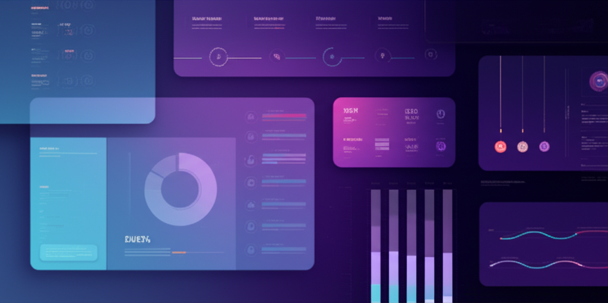

  
  <h1>GangsterGPT</h1>
  
منصة ذكاء اصطناعي متكاملة للمطورين والمصممين

  
  
  
  
  
  

## 🔥 نظرة عامة

**GangsterGPT** هي منصة ذكاء اصطناعي متطورة تمكن المطورين والمصممين من إنشاء تطبيقات وواجهات مستخدم بسرعة وكفاءة. المنصة تدعم استخدام مفاتيح API الخاصة بالمستخدمين، مما يتيح لهم الاستفادة من نماذج الذكاء الاصطناعي المفضلة لديهم.

  

## ✨ المميزات الرئيسية

### 🤖 تكامل متعدد لنماذج الذكاء الاصطناعي
- **استخدام مفاتيح API الخاصة بك** - أدخل مفاتيح API الخاصة بك لـ OpenAI، Anthropic، Google AI وغيرها
- **دعم متعدد النماذج** - GPT-4، Claude، Gemini، Groq، Grok وغيرها
- **مساعد ذكاء اصطناعي مدمج** - احصل على مساعدة فورية أثناء العمل على مشاريعك

### 💻 محرر كود متطور
- **تلوين بناء الجملة** - دعم لأكثر من 100 لغة برمجة
- **إكمال الكود** - اقتراحات ذكية أثناء الكتابة
- **معاينة مباشرة** - شاهد التغييرات في الوقت الفعلي

### 🎨 أدوات تصميم متقدمة
- **إنشاء واجهات مستخدم** - تصميم واجهات مستخدم جذابة بسرعة
- **مكتبة مكونات** - مجموعة واسعة من المكونات الجاهزة للاستخدام
- **نظام ألوان متكامل** - إنشاء وإدارة أنظمة ألوان احترافية

### ☁️ تكامل قواعد البيانات
- **Neon PostgreSQL** - تخزين البيانات الهيكلية
- **Upstash Redis** - تخزين مؤقت عالي الأداء
- **Supabase** - إدارة المستخدمين والتخزين

### 📊 لوحة تحكم شاملة
- **إدارة المشاريع** - إنشاء وتنظيم وتتبع مشاريعك
- **تحليلات** - رؤى وإحصاءات حول استخدام المنصة
- **إعدادات مخصصة** - تخصيص المنصة وفقًا لاحتياجاتك

## 🚀 البدء السريع

### المتطلبات الأساسية
- Node.js 18.0.0 أو أحدث
- npm أو yarn أو pnpm

### التثبيت

\`\`\`bash
# استنساخ المستودع
git clone https://github.com/yourusername/gangstergpt.git

# الانتقال إلى دليل المشروع
cd gangstergpt

# تثبيت التبعيات
npm install
# أو
yarn install
# أو
pnpm install

# بدء خادم التطوير
npm run dev
# أو
yarn dev
# أو
pnpm dev
\`\`\`

افتح [http://localhost:3000](http://localhost:3000) في متصفحك لمشاهدة التطبيق.

## 🔧 التكوين

### متغيرات البيئة

قم بإنشاء ملف `.env.local` في الدليل الرئيسي وأضف المتغيرات التالية:

\`\`\`env
# مفاتيح API للذكاء الاصطناعي (اختياري - يمكن للمستخدمين إضافة مفاتيحهم الخاصة)
OPENAI_API_KEY=your_openai_api_key
ANTHROPIC_API_KEY=your_anthropic_api_key
GOOGLE_AI_API_KEY=your_google_ai_api_key
GROQ_API_KEY=your_groq_api_key
XAI_API_KEY=your_xai_api_key

# تكامل قواعد البيانات
NEON_DATABASE_URL=your_neon_database_url
REDIS_URL=your_upstash_redis_url
\`\`\`

## 📖 دليل الاستخدام

### إدارة مفاتيح API
1. انتقل إلى صفحة الإعدادات
2. اختر "مفاتيح API"
3. أضف مفاتيح API الخاصة بك لمختلف مزودي خدمات الذكاء الاصطناعي
4. قم بتفعيل/تعطيل المفاتيح حسب الحاجة

### إنشاء مشروع جديد
1. انتقل إلى لوحة التحكم
2. انقر على "مشروع جديد"
3. اختر قالبًا أو ابدأ من الصفر
4. قم بتخصيص المشروع باستخدام محرر الكود ومساعد الذكاء الاصطناعي

### استخدام مساعد الذكاء الاصطناعي
1. افتح مشروعًا
2. انتقل إلى تبويب "مساعد الذكاء الاصطناعي"
3. اختر نموذج الذكاء الاصطناعي المفضل لديك
4. اطرح أسئلة أو اطلب مساعدة في الكود أو التصميم

## 🏗️ الهيكل التقني

- **Frontend**: Next.js 14، React، TypeScript، Tailwind CSS
- **State Management**: React Context API، Zustand
- **Database**: Neon PostgreSQL، Upstash Redis
- **AI Integration**: OpenAI، Anthropic، Google AI، Groq، Grok
- **Authentication**: NextAuth.js، Supabase Auth
- **Deployment**: Vercel

## 🤝 المساهمة

نرحب بالمساهمات من المجتمع! إذا كنت ترغب في المساهمة، يرجى اتباع الخطوات التالية:

1. قم بعمل Fork للمستودع
2. قم بإنشاء فرع لميزتك (`git checkout -b feature/amazing-feature`)
3. قم بإجراء تغييراتك (`git commit -m 'Add some amazing feature'`)
4. قم بدفع الفرع (`git push origin feature/amazing-feature`)
5. افتح طلب سحب

## 📄 الترخيص

هذا المشروع مرخص بموجب ترخيص MIT - انظر ملف [LICENSE](LICENSE) للحصول على التفاصيل.

## 📞 الدعم

إذا واجهت أي مشاكل أو كانت لديك أسئلة، يرجى فتح مشكلة في هذا المستودع أو التواصل معنا عبر:

- البريد الإلكتروني: support@gangstergpt.com
- تويتر: [@GangsterGPT](https://twitter.com/GangsterGPT)

---

  
صنع بـ ❤️ بواسطة فريق GangsterGPT

  
حقوق النشر © 2024 GangsterGPT. جميع الحقوق محفوظة.

