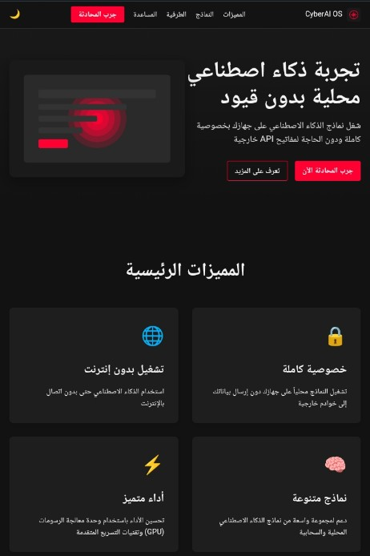

<div align="center">
  
  <h1>GangsterGPT</h1>
  <p>منصة ذكاء اصطناعي متكاملة للمطورين والمصممين</p>

  <!-- Badges -->
  
  
</div>

---

<!-- Animated Hero Section -->
<p align="center">
  
</p>

## 🔥 نظرة عامة

**GangsterGPT** هي منصة ذكاء اصطناعي متطورة تمكن المطورين والمصممين من إنشاء تطبيقات وواجهات مستخدم بسرعة وكفاءة. المنصة تدعم استخدام مفاتيح API الخاصة بالمستخدمين، مما يتيح لهم تحكمًا كاملاً في سير عملهم.

> "تم تصميم GangsterGPT بعقلية **Deep Thinking** لتمكينك من بناء المستقبل بذكاء وثقة."

---

## ✨ المميزات الرئيسية

| 🚀 الميزة | 💡 الوصف |
|-----------|----------|
| 🤖 **تكامل متعدد لنماذج الذكاء الاصطناعي** | دعم GPT-4، Claude، Gemini، Groq، Grok وغيرها بواجهة موحدة |
| 💻 **محرر كود متطور** | تلوين بناء الجملة، إكمال ذكي، معاينة فورية، وThemes متحركة |
| 🎨 **أدوات تصميم غنية** | مكتبة مكونات UI، نظام ألوان حيّ، وتوليد تصميمات تلقائيًا |
| ☁️ **قواعد بيانات سحابية** | Neon PostgreSQL، Upstash Redis، Supabase |
| 📊 **لوحة تحكم تفاعلية** | رسوم بيانية حية (Recharts) وتحليلات لحظية |
| 🔐 **أمان متقدم** | مصادقة 2FA، تشفير بيانات، وسياسة صلاحيات دقيقة |

---

## 🚀 البدء السريع

### المتطلبات الأساسية
- **Node.js** 18.0.0 أو أحدث
- **npm** أو **yarn** أو **pnpm**

```bash
# استنساخ المستودع
git clone https://github.com/openaziz/cyberai-os.git

# الانتقال إلى دليل المشروع
cd cyberai-os

# تثبيت التبعيات
pnpm install

# بدء خادم التطوير
pnpm dev

افتح http://localhost:3000 في متصفحك لمشاهدة التطبيق.


---

🏗️ الهيكل التقني

flowchart TD
  A[Next.js 14] --> B[React & TypeScript]
  B --> C[Tailwind CSS]
  B --> D[Zustand]
  A --> E[NextAuth.js]
  A --> F[Supabase]
  G[OpenAI / Anthropic / Google AI / Groq] --> H(GangsterGPT Core)
  F --> H
  C --> I[UI Components]


---

📸 لقطات من المنصة

الواجهة	الوصف

	لوحة التحكم الرئيسية بتأثير Parallax
	تفاعل مباشر مع المساعد الذكي


---

🤝 المساهمة

نرحب بالمساهمات من المجتمع! يرجى اتباع الخطوات التالية:

1. Fork للمستودع


2. إنشاء فرع feature/awesome


3. Commit بتفاصيل واضحة


4. Push وفتح Pull Request


---

📄 الترخيص

مشروع مرخص تحت رخصة MIT.


---

<div align="center">
  <sub>صُنع بعقلية <strong>Deep Thinking</strong> ⚡️ بواسطة فريق GangsterGPT © 2024</sub>
</div>

